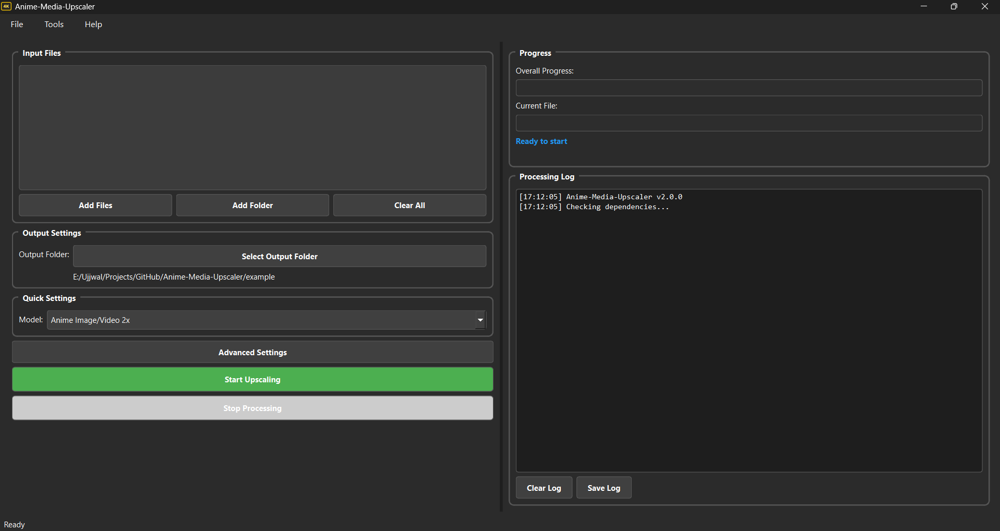

# 🚀 real-esrgan-gui v2.0.0

  

<p align="center">
  
</p>

real-esrgan-gui is a powerful, open‑source desktop application built with PyQt6, leveraging Real‑ESRGAN AI models and FFmpeg to batch upscale your favorite anime images and videos with ease 

---

## ✨ What’s New in v2.0.0

- ✅ **Video Upscaling** support via frame‑by‑frame Real‑ESRGAN + FFmpeg reassembly  
- ✅ **Multi‑threaded** batch processing with real‑time progress bars  
- ✅ **Advanced Settings** dialog: model selection, GPU toggle, tile size, FPS & quality  
- ✅ **Comprehensive Logging** system with save/load capability  
- ✅ **Drag‑and‑Drop** interface enhancements  

---

## 🛠️ All Features

- **Image Upscaling**: JPG/PNG/BMP/TIFF/WebP → 2×/3×/4× scales  
- **Video Upscaling**: MP4/AVI/MKV/MOV/WMV/FLV → upscaled frames + original audio  
- **Batch Queue**: enqueue multiple files for sequential processing  
- **Model Manager**: choose from anime‑optimized & general SR Real‑ESRGAN variants  
- **GPU Acceleration**: CUDA/OpenCL support for faster upscaling  
- **Advanced Settings**: tile size, output format (jpg/png/webp), FPS, CRF quality  
- **Auto‑Folder**: outputs organized into timestamped sessions  
- **Drag‑and‑Drop**: intuitive file/folder addition  
- **Logging**: timestamped logs, clear & save to file  

---

## 🗂️ Folder Structure

```
real-esrgan-gui/
├── .gitignore               # Git ignore file
├── LICENSE                  # MIT License
├── README.md                # This file
├── requirements.txt         # Python dependencies
├── example/                 # Sample inputs & outputs
│   ├── pikachu.jpg
│   └── pikachu_upscaled_x4.jpg
├── screenshots/             # UI previews
│   └── screenshot.png
└── src/                     # Source directory
    ├── build.bat            # Script to build the application
    ├── favicon.ico          # Application icon
    ├── main.py              # Application entry point
    ├── app/                 # Core application logic
    │   ├── __init__.py
    │   ├── main_window.py   # Main application window
    │   ├── settings_dialog.py # Settings dialog
    │   ├── ui_utils.py      # Utility functions for UI
    │   └── workers.py       # Worker threads for processing
    ├── bin/                 # External binaries
    │   ├── ffmpeg.exe
    │   └── realesrgan-ncnn-vulkan.exe
    └── models/              # AI models
        ├── realesr-animevideov3-x2.bin
        ├── realesr-animevideov3-x2.param
        ├── ...

```

---

## 📋 Requirements

- **Python 3.8+**  
- **pip** package manager  
- **CUDA‑enabled GPU** (optional, for acceleration)  
- **Real‑ESRGAN** & **FFmpeg** binaries in `bin/` or system PATH  

Install dependencies:

```bash
pip install -r requirements.txt
````

> Or manually:
>
> ```bash
> pip install PyQt6 colorlog
> ```

---

## ⚙️ Installation

1. **Clone** the repository

   ```bash
   git clone https://github.com/ukr-projects/real-esrgan-gui.git
   cd real-esrgan-gui
   ```
2. **Ensure** `bin/ffmpeg` and `bin/realesrgan-ncnn-vulkan` are present or in PATH
3. **Install** Python dependencies

   ```bash
   pip install -r requirements.txt
   ```

---

## ▶️ Usage

1. **Run** the app:

   ```bash
   python main.py
   ```
2. **Add Files**: drag‑and‑drop or click **Add Files** / **Add Folder**
3. **Select Output Folder** and configure quick or advanced settings
4. **Start Upscaling** and monitor **Overall** & **Current** progress bars
5. **Save Logs** or **Open Output** once complete

---

## 🖼️ Example Inputs & Outputs

<p align="center">
  
  
</p>

## 📸 Screenshot



---

## 🤝 How to Contribute

1. **Fork** the repo
2. **Create** a branch:

   ```bash
   git checkout -b feature/YourFeature
   ```
3. **Commit** your improvements
4. **Push** & **Open** a Pull Request

---

## 🙏 Acknowledgments

* [Real‑ESRGAN](https://github.com/xinntao/Real-ESRGAN) for super‑resolution models
* [PyQt6](https://pypi.org/project/PyQt6/) for the GUI framework
* [FFmpeg](https://ffmpeg.org/) for high‑quality video processing

## 🌟 Star History

If you find this project useful, please consider giving it a star on GitHub! Your support helps us continue improving and maintaining this tool.

## 📞 Support

- **GitHub Issues**: [Report bugs or request features](https://github.com/ukr-projects/real-esrgan-gui/issues)
- **Discussions**: [Community discussions and Q&A](https://github.com/ukr-projects/real-esrgan-gui/discussions)
- **Email**: ukrpurojekuto@gmail.com

---

<div align="center">

**Made with ❤️ by the Ujjwal Nova**

[⭐ Star this repo](https://github.com/ukr-projects/real-esrgan-gui) | [🐛 Report Bug](https://github.com/ukr-projects/real-esrgan-gui/issues) | [💡 Request Feature](https://github.com/ukr-projects/real-esrgan-gui/issues)

</div>
