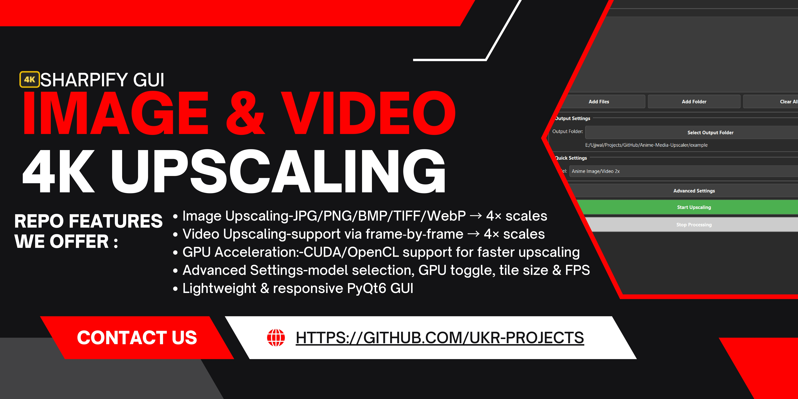
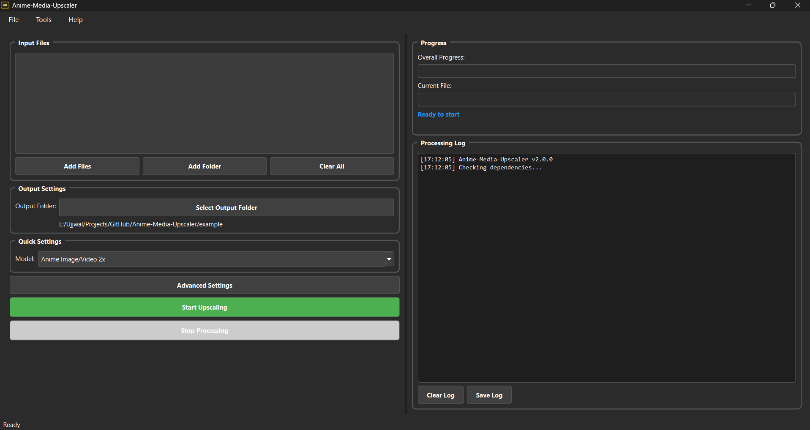

<h1>
  
  sharpify-gui
</h1>

[](LICENSE)
[](STATUS.md)
[](CHANGELOG.md)


<div align="center">
  
</div>

<div align="center">
  
</div>

---
## 🖼 Screenshot

<div align="center">
  
  <p><em>GUI Interface</em></p>
</div>

---

## 🖼️ Example

<div align="center">
  <h3>Input</h3>
  
  <h3>Output</h3>
  
</div>

---

## ✨ What’s New in v1.0.0

- 🎉 **Initial release** with core download and UI functionality  
- ✅ **Video Upscaling** support via frame‑by‑frame Real‑ESRGAN + FFmpeg reassembly  
- ✅ **Multi‑threaded** batch processing with real‑time progress bars  
- ✅ **Advanced Settings** dialog: model selection, GPU toggle, tile size, FPS & quality  
- ✅ **Comprehensive Logging** system with save/load capability  
- ✅ **Drag‑and‑Drop** interface enhancements  

---

## 🛠️ All Features

- **Image Upscaling**: JPG/PNG/BMP/TIFF/WebP → 4× scales  
- **Video Upscaling**: MP4/AVI/MKV/MOV/WMV/FLV → upscaled frames + original audio  
- **Batch Queue**: enqueue multiple files for sequential processing  
- **Model Manager**: choose from anime‑optimized & general SR Real‑ESRGAN variants  
- **GPU Acceleration**: CUDA/OpenCL support for faster upscaling  
- **Advanced Settings**: tile size, output format (jpg/png/webp), FPS, CRF quality  
- **Auto‑Folder**: outputs organized into timestamped sessions  
- **Drag‑and‑Drop**: intuitive file/folder addition  
- **Logging**: timestamped logs, clear & save to file  

---

## 🗂️ Folder Structure

```
sharpify-gui/
├── .github/
│   ├── ISSUE_TEMPLATE/
│   │   ├── bug_report.md
│   │   └── feature_request.md
│   ├── PULL_REQUEST_TEMPLATE.md
│   └── workflows/
│       └── ci.yml
├── .gitignore
├── assets/
│   ├── example/
│   │   ├── pikachu_upscaled_x4.jpg
│   │   └── pikachu.jpg
│   ├── screenshots/
│   │   └── screenshot.png
│   └── sharpify-gui-logo.ico
├── docs/
│   ├── CHANGELOG.md
│   ├── CODE_OF_CONDUCT.md
│   ├── CONTRIBUTING.md
│   ├── README.md
│   ├── SECURITY.md
│   ├── STATUS.md
│   └── USAGE.md
├── LICENSE
├── pyproject.toml
├── requirements.txt
├── src/
│   ├── app/
│   │   ├── __init__.py
│   │   ├── main_window.py
│   │   ├── settings_dialog.py
│   │   ├── ui_utils.py
│   │   └── workers.py
│   ├── bin/
│   │   ├── ffmpeg.exe
│   │   └── realesrgan-ncnn-vulkan.exe
│   ├── build.bat
│   ├── favicon.ico
│   ├── main.py
│   └── models/
│       ├── realesr-animevideov3-x4.bin
│       ├── realesr-animevideov3-x4.param
│       ├── realesrgan-x4plus-anime.bin
│       ├── realesrgan-x4plus-anime.param
│       ├── realesrgan-x4plus.bin
│       └── realesrgan-x4plus.param
└── tests/
    └── test_workers.py

```

---

## 🕹 Usage

### Prerequisites

- GitHub

### Installation

```bash
# Clone the repository
git clone https://github.com/uikraft-hub/sharpify-gui.git
```

For more detailed documentation, see our [USAGE.md](USAGE.md)

---

## 🤝 Contributing

Please see our [Contributing Guide](CONTRIBUTING.md) for details.

---

### Code of Conduct

This project follows our [Code of Conduct](CODE_OF_CONDUCT.md). Please read it before contributing.

---

## 📋 Roadmap

- [x] GPU Acceleration
- [x] Model Manage
- [x] Batch Queue

See the [open issues](https://github.com/uikraft-hub/sharpify-gui/issues) for a full list of proposed features and known issues.

---

## 📝 Changelog

All notable changes to this project are documented in [CHANGELOG.md](CHANGELOG.md).

---

## 📄 License

This project is licensed under the MIT License - see the [LICENSE](../LICENSE) file for details.

---


## 🙏 Acknowledgments

* [Real‑ESRGAN](https://github.com/xinntao/Real-ESRGAN) for super‑resolution models
* [PyQt6](https://pypi.org/project/PyQt6/) for the GUI framework
* [FFmpeg](https://ffmpeg.org/) for high‑quality video processing

---

## 📞 Support

- 📧 Email: ujjwalkrai@gmail.com
- 🐛 Issues: [Repo Issues](https://github.com/uikraft-hub/sharpify-gui/issues)
- 🔓 Security: [Repo Security](https://github.com/uikraft-hub/sharpify-gui/security)
- ⛏ Pull Request: [Repo Pull Request](https://github.com/uikraft-hub/sharpify-gui/pulls)
- 📖 Docs: [Repo Documentation](https://github.com/uikraft-hub/sharpify-gui/tree/main/docs)
- 📃 Changelog: [Repo Changelog](https://github.com/uikraft-hub/sharpify-gui/docs/CHANGELOG.md)
---

## 🔗 Connect

#### 📝 Writing & Blogging
[](https://ukr-projects.hashnode.dev/)
[](https://medium.com/@ukrpurojekuto)

#### 💼 Professional
[](https://ukr-projects.github.io/ukr-projects/)
[](https://github.com/ukr-projects)
[](https://github.com/cyberx-projects)
[](https://github.com/contro-projects)
[](https://www.linkedin.com/in/u-k-r/ )
[](https://www.youtube.com/@ujjwal-krai)

#### 🌐 Social
[](https://x.com/ukr_projects)
[](https://www.instagram.com/ukr_projects)
[](https://www.youtube.com/@ukr-projects)
[](https://t.me/ukr_projects)
[](https://www.reddit.com/user/mrujjwalkr)

---

<div align="center">
  Made with ❤️ by <a href="https://github.com/ukr-projects">ukr</a>
</div>

---
